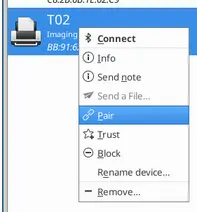
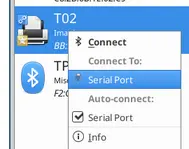

# Print with Phomemo T02

Simple bash script I use to print a PNG file with Phomemo T02 printer. Very straightforward (no CUPS filter).

This script depends on [Phomemo Tools](https://github.com/vivier/phomemo-tools/) by [Laurent Vivier](https://github.com/vivier).

## Why

For [some reason](https://github.com/vivier/phomemo-tools/issues/30) I'm unable to use [Phomemo Tools](https://github.com/vivier/phomemo-tools/)'s CUPS filter so I made this scipt.

## Installation

- clone or download [Phomemo Tools](https://github.com/vivier/phomemo-tools) somewhere
- `cp .env.example .env`
- edit `.env` file and fill phenomeno-tools base dir (the dir where you cloned or downloaded Phomemo Tools)

## Usage

- choose the image you want to print. If using PNG format, make sure there is **no transparency**

### Connect to printer (Bluetooth)

- switch printer on
- connect printer via *serial com* other bluetooth
  - you can use [*blueman-manager*](https://github.com/blueman-project/blueman) to easilly to this with a GUI:

    

    Do **not** use *connect* but **pair**

    

### From command line

```bash
print-with-T02.sh myimage.png
```

### Using a Nautilus Action

I'm using this script as a [Nautilus Action](https://github.com/bassmanitram/actions-for-nautilus) (so I can use right-clic on a file and print it)


```json
{
    "type": "command",
    "label": "🖨️ Print with Phomemo",
    "command_line": "/home/bruno/dev/Print-with-Phomemo-T02/print-with-T02.sh %f",
    "cwd": "%d",
    "mimetypes": [
        "image/*"
    ]
},
```
